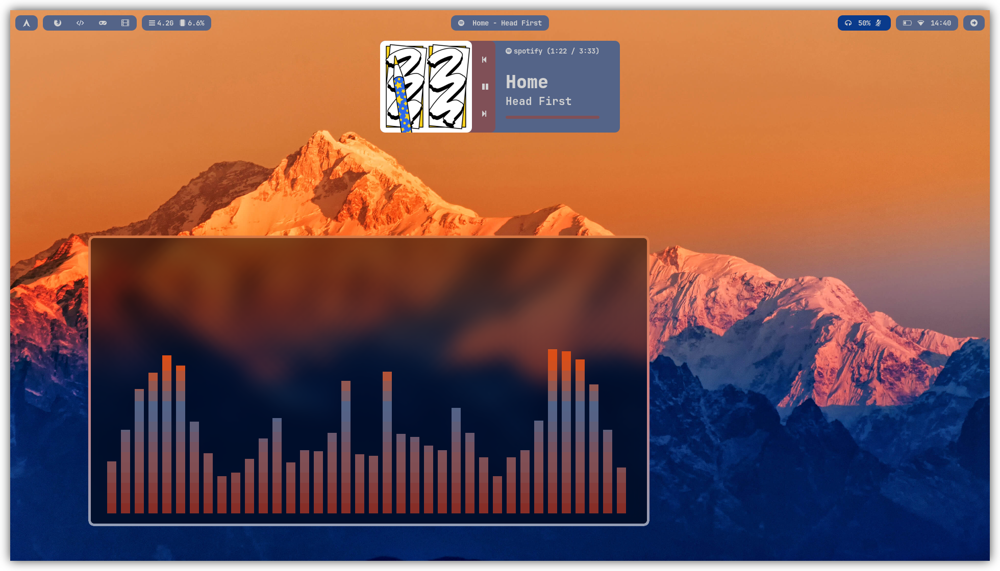
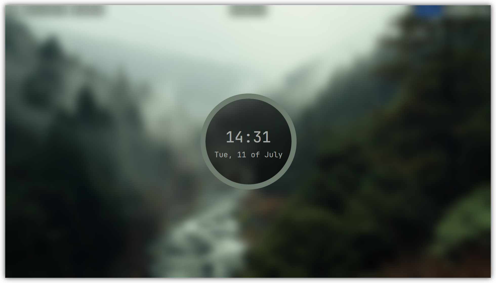
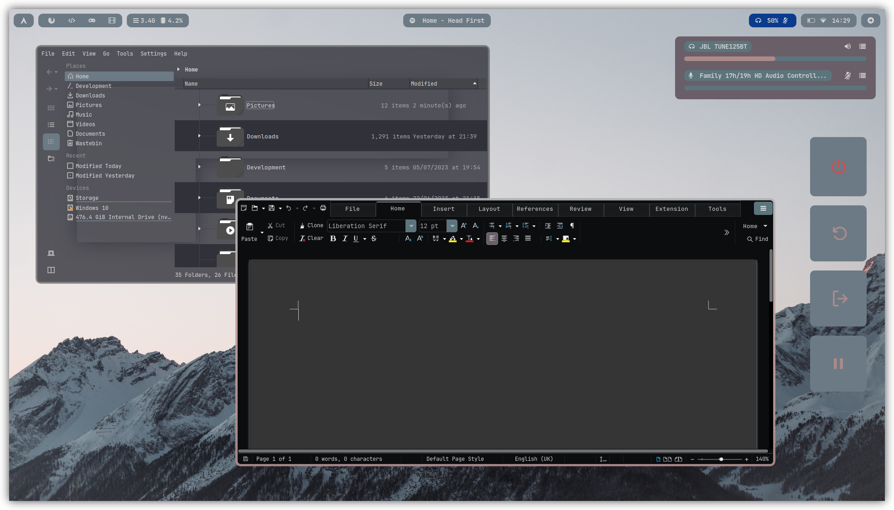

<h2 align="center">Hyprland w/ pywal</h2>

<div align="center">
    <p>Now with unlimited color themes!</p>
    </img>
    </img>
    </img>
</div>

> For a showcase video see [here](https://www.youtube.com/watch?v=nNvciN4sGKQ).

### Installation
> [!WARNING]
> Several people have reported the install script DOES NOT WORK. At this moment I do not have access to a spare PC to test it with, treat this repo as a reference only until I can find a way to fix stuff (or until I switch to NixOS lol). And for those who have tried it and are still willing to try again somehow, you can open an issue and I'll see what i can do.

1) Run the install script

```sh
wget https://raw.githubusercontent.com/Abaan404/dotfiles/main/install.sh && sh install.sh
```

2) Create a `~/.dotfiles/.env` file with the following entries.

```sh
OPENWEATHER_API_KEY= # https://openweathermap.org/api
OPENWEATHER_LOCATION= # https://openweathermap.org/api
UNSPLASH_ACCESS_KEY= # https://unsplash.com/developers
```

### Usage
- Switch theme with SUPER + H, see `./config/hypr/keybinds.conf` for all keybinds.

### Notes
- The power profile only works for [Lenovo Ideapad Gaming 3 Laptops](https://wiki.archlinux.org/title/Lenovo_IdeaPad_Gaming_3).
- The wallpaper path (`~/Pictures/wallpapers/`) and pywal backend (`colorthief`) can be modified within the `./scripts/reload.py` file.
- `~/.dotfiles/scripts/reload.py` is the main script that overwrites everything from `~/.dotfiles/config` into your `~/.config/` folder by replacing special strings with color values applicable to the wallpaper.
- The way this repo is setup, it expects that you have this repo cloned in `~/.dotfiles` exactly as is and with your `.env` variables defined in the same folder.

### Credits and Acknowledgements
- [end-4/dots-hyprland](https://github.com/end-4/dots-hyprland)'s wonderful dots and [dharmax](https://dharmx.is-a.dev/eww-powermenu/)'s guide to get me started on eww.
- Kvantum Theme (modified with pywal) by [vinceliuice/Layan-kde](https://github.com/vinceliuice/Layan-kde).
- my sanity for keeping up with me (it didnt).
